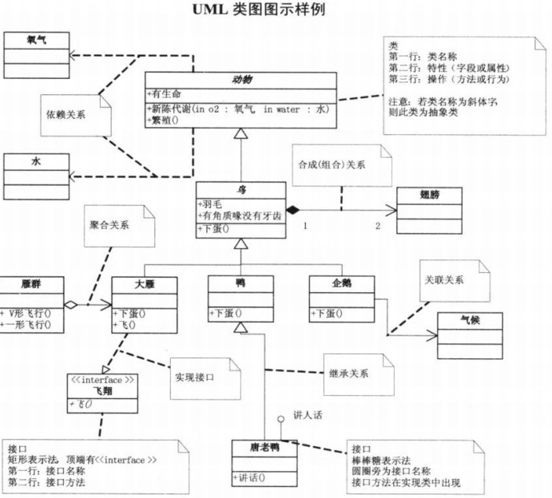
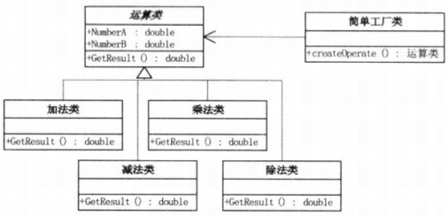

# UML类图
UML类图可以表示不同类之间的关系，常用于描述设计方法等 

# 简单工厂模式
将operation抽象为一个类，所有的计算类型例如加减乘除都继承自这个类，如需新增一个计算只需要新实现一个operation类的子类即可，不会对原有功能产生影响，不同操作类之间没有关系，这样的设计是松耦合，提高了代码的可扩展性。

设计一个单独的工厂类管理上述不同功能的子类。根据输入参数选择实例化对应的类，返回一个指向正确子类的基类指针，这里用到了OOP的**多态**特性。

此例的UML图如下 

