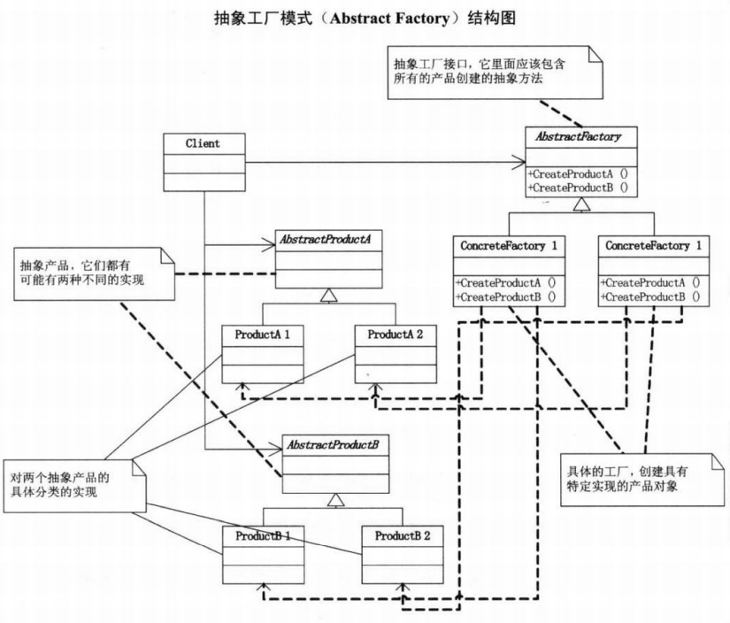

# 抽象工厂模式

提供一个创建一系列相关或相互依赖对象的接口，而无需指定他们具体的类

抽象工厂用于统一工厂类，创建不同的工厂实例可以使用不同系统的产品。抽象产品则用于代表不同系统中的同一种产品。

当系统的产品有多于一个的产品族，而系统只消费其中某一族的产品时使用。

**优点：**保证客户端始终只使用同一个产品族中的产品，便于替换产品族

**缺点：**产品族扩展困难，需要同时更改工厂类和产品类

总体概括就是**产品族难扩展，产品等级易扩展**

UML图 
