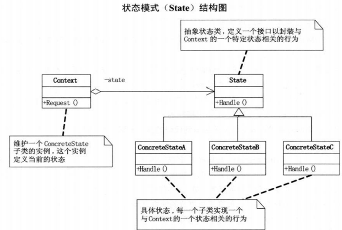

# 状态模式

当一个对象的内在状态改变时允许改变其行为，看起来像是改变了其类

当代码中包含大量与对象状态有关的条件语句考虑使用此方法。

**优点：** 

1. 方便增加状态
2. 封装了转换规则，将状态转换逻辑与状态对象合成一体
3. 多个环境对象共享一个状态对象，减少系统中对象的个数。

**缺点：** 

1. 增加系统类和对象的个数。
2. 对"开闭原则"的支持不太好，新增状态需要改变原有状态的转换逻辑

UML图 
