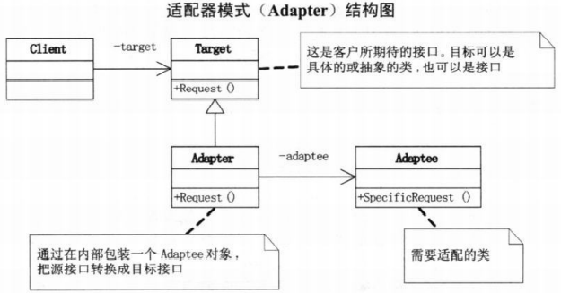

# 适配器模式

将一个类的接口转换成需要的另外一个接口，使原本由于接口不兼容而不能一起工作的类可以一起工作

当系统需要使用现有的类，而此类的接口不符合系统的需要或者想要建立可以重复使用的类，用于与一些彼此之间没有太大关联的一些类，包括一些可能在将来引进的类一起工作，这些源类不一定有一致的接口，可以使用适配器模式

**优点：** 可以让没有关联的类一起运行；提高了类的复用，灵活性好。

**缺点：** 会导致代码结构复杂不易理解

UML图 
