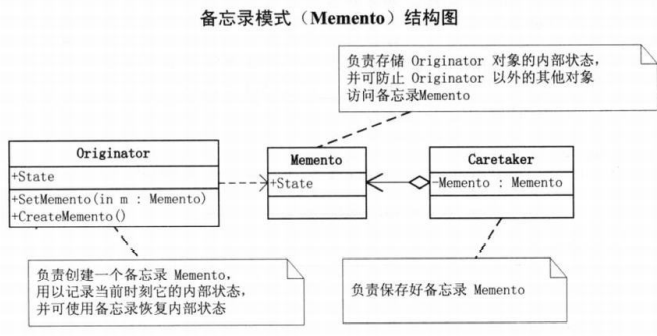

# 备忘录模式

在不破坏封装性的前提下，捕获一个对象的内部状态，并在该对象之外保存。这样之后可以进行状态恢复

在需要保存/恢复数据的相关状态场景或者需要提供一个可回滚的操作的时候可以使用备忘模式，例如游戏存档，命令撤销等

**优点：** 1、提供了一种可以恢复状态的机制，可以比较方便地回到某个历史的状态。；实现了信息封装，用户不需要关心保存细节。

**缺点：** 消耗资源。如果类的成员变量过多，会占用比较大的资源，而且每一次保存都会消耗一定的内存。

**注意事项：** 1、为了符合迪米特原则，需要增加**管理备忘录的类**。 2、为了节约内存，可使用原型模式+备忘录模式

UML图 
