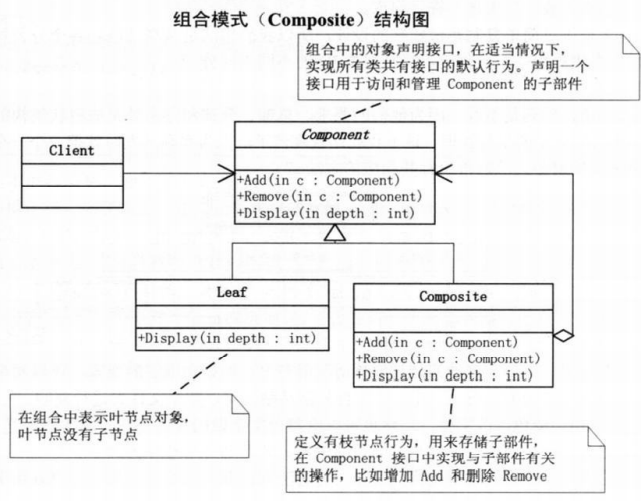

# 组合模式

将对象组合成树形结构以表示“部分-整体”的层次结构，使用户对单个对象和组和对象的使用具有一致性

常用在树型结构的问题中，可以像处理简单元素一样来处理复杂元素，从而使得客户程序与复杂元素的内部结构解耦。

**透明方式与安全方式**

透明方式是将Add，Remove等功能放在基类中，优点是接口对外统一，但leaf类本身不具备这些功能

安全方式是将Add，Remove等功能放在component中，但不够透明，对外接口不一致

**优点：** 1、高层模块调用简单。 2、节点自由增加

**缺点：** 在使用组合模式时，其叶子和树枝的声明都是实现类，而不是接口，违反了依赖倒置原则

UML图 
