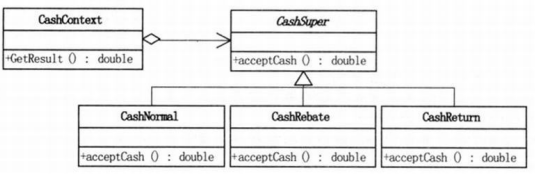

# 策略模式
策略模式用于不同方法之间的替换。定义一系列算法，完成相同的工作但实现不同。通过策略模式可以以相同的方式调用所有的算法。通常会定义一个Context类，接收不同的算法对象，执行相同的计算操作。这样可以将算法使用者与算法类的耦合

# 策略模式与简单工厂模式的比较
简单工厂类中是根据接收的条件创建一个相应的**对象**，而 **Context** 类接收的是一个对象，可以调用方法去执行此对象的**方法**。

从类型上说：简单工厂模式属于**创建型模式**，而策略模式属于**行为型模式**。

简单工厂模式：根据客户选择的条件，来帮客户创建一个对象。将对象的选择创建交给了简单工厂类，客户端只需要输入相应的条件就可以，不用负责对象的创建，但是需要客户端自己调用算法类的方法。但是一旦需要增加新的运算类，比如开根运算，就要去修改简单工厂类。

策略模式：客户给它一个创建好的对象，它来帮客户做相应的事。对象的选择创建仍需要自己来做，但是将调用方法的职责交给了Context类。一旦需要增加新的策略需要修改客户端。

将策略模式中用户创建对象的部分也移到Context类中使用简单工厂方式实现，就可以更减少客户端的代码。只需要暴露一个Context类就可以完成功能。code sample 采用这种方式，可以看到h文件中只暴露了一个context类及cashsuper的前置声明

策略模式的UML图如下 

