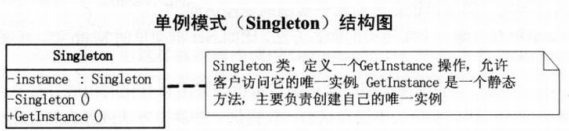

# 单例模式

保证一个类仅有一个实例，并提供一个访问他的全局访问点

懒汉式：当使用时才实例化对象，可以实现lazy load目的。通过加锁避免多线程调用的错误，通常使用**双检锁**在保证线程安全的同时提高效率。

**Meyers' Singleton：**C++11规定了local static在多线程条件下的初始化行为，要求编译器保证**局部静态变量**的线程安全性。因此《Effective C++》提出了一种更优雅的单例模式实现：使用函数内的局部静态变量对象。只有当第一次访问`getInstance()`方法时才创建实例。C++0x之后该实现是线程安全的，C++0x之前仍需加锁。

饿汉式：当初始化程序时创建单个对象，在main之前创建，不存在线程安全问题，是空间换时间的方法。潜在问题在于非局部静态对象在不同编译单元中的初始化顺序是未定义的。即单例的创建和单例的调用二者的初始化顺序不确定，如果在初始化完成之前调用 getInstance() 方法会返回一个未定义的实例。

**优点：** 1、在内存里只有一个实例，减少了内存的开销，尤其是频繁的创建和销毁实例。2、避免对资源的多重占用

**缺点：** 没有接口，**不能继承**，与单一职责原则冲突，一个类应该只关心内部逻辑，而不关心外面怎么样来实例化

UML图 
