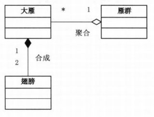
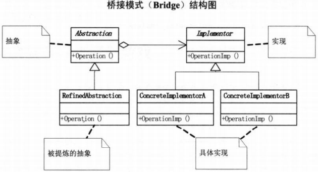

# 桥接模式

**合成/聚合复用原则** ：尽量使用合成/聚合，尽量不使用类继承

合成又叫组合，是一种强关系，表示部分与整体，例如翅膀与大雁

聚合是一种弱关系，表示个体与群体，例如大雁与雁群

**桥接模式** ：将抽象部分与它的实现部分分离，使它们都可以独立变化

实现系统可以有多个角度的分类，每一种分类都有可能有变化，把多角度分离出来使其独立变化，减少耦合

**优点：** 1、抽象和实现分离。 2、具有优秀的扩展能力。 3、实现细节对客户透明。

**缺点：** 桥接模式的引入会增加系统的理解与设计难度，由于聚合关联关系建立在抽象层，要求开发者针对抽象进行设计与编程。

UML图 
