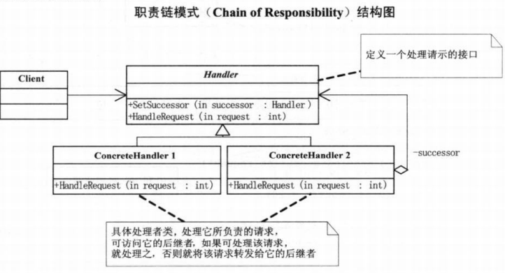

# 职责链模式

使多个对象都有机会处理请求，从而降低请求的发送者和接受者之间的耦合。将对象连成一条链，并沿着链传递请求，直到有对象处理它为止

**优点：** 1、降低耦合度。将请求的发送者和接收者解耦。 2、简化对象。使得对象不需要知道链的结构。 3、增强给对象指派职责的灵活性。通过改变链内的成员或者调动它们的次序，允许动态地新增或者删除责任。 4、方便增加新的请求处理类

**缺点：** 1、不能保证请求一定被接收。 2、系统性能将受到一定影响，而且在进行代码调试时不太方便，可能会造成循环调用。 3、不容易观察运行时的特征，有碍于除错。

UML图 
