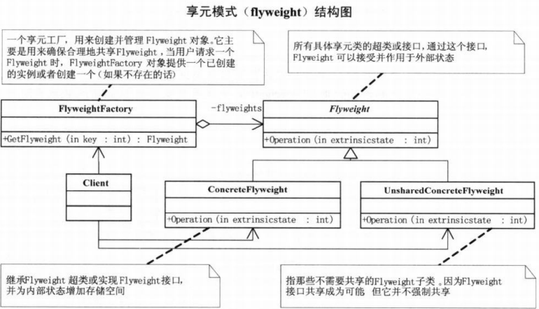

# 享元模式

运用共享技术有效地支持大量细粒度的对象

当系统中使用大量对象，而且这些对象的状态大部分可以外部化，可以用享元模式减少对象数量。这些对象可以按照内部状态分为很多组，每一组对象都可以用一个对象来代替

**优点：** 减少对象的创建，降低系统的内存，使效率提高。

**缺点：** 提高了系统的复杂度，需要分离出外部状态和内部状态，而且外部状态具有固有化的性质，不应该随着内部状态的变化而变化，否则会造成系统的混乱。

UML图 
