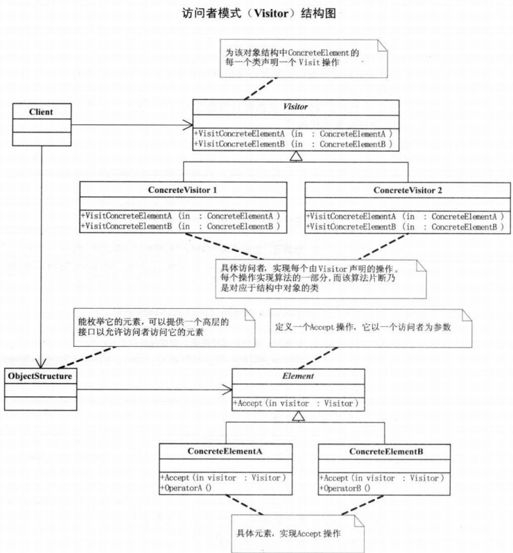

# 访问者模式

表示一个作用于某对象结构中的各元素的操作，使得可以在不改变各元素的类的前提下定义作用于这些元素的新操作

如果对象结构中对象对应的类很少改变，但经常需要在此对象结构上定义新的操作；或者需要对一个对象结构中的对象进行很多不同且不相关的操作，不希望在增加新操作时修改这些类，可以考虑使用访问者模式

**优点：** 1、符合单一职责原则。 2、优秀的扩展性。 3、灵活性。

**缺点：** 1、具体元素对访问者公布细节，违反了迪米特原则。 2、具体元素变更比较困难。 3、违反了依赖倒置原则，依赖了具体类，没有依赖抽象。

代码中用到了”双分派”技术，在客户程序中将Action传递给Man完成了一次分派，Man调用Action中的GetManConclusion方法，同时将this指针作为参数传入，这是第二次分派。

UML图 
