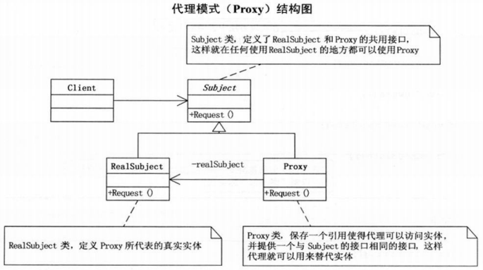

# 代理模式
Proxy：为其他对象提供一种代理以控制对这个对象的访问

UML图如下

主要应用

1. 远程代理：为对象在不同地址空间提供局部代表，客户端可以调用代理完成远程访问
2. 虚拟代理：根据需要创建开销很大的对象，用于存放实例化时间较长的真实对象，例如浏览器中的图片下载
3. 安全代理：可以控制真实对象的访问权限，例如给不同对象不同级别的权限等
4. 智能代理：调用真实对象的时进行一些额外操作，例如计数，自动释放，保持单一访问等等

代理就是在访问对象时引入一定程度的间接性，从而附加额外的功能